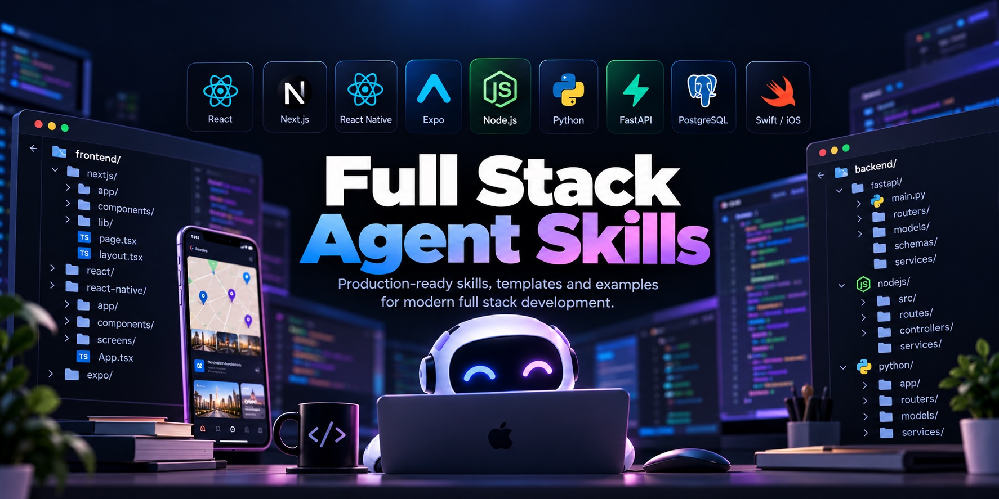

# fullstack-agent-skills

Opinionated agent skills for shipping production apps on Next.js, FastAPI, PostgreSQL/PostGIS, Expo, and SwiftUI.

[](https://github.com/suleyman/fullstack-agent-skills/actions/workflows/validate.yml)
[](LICENSE)

## Why this exists

Coding agents know every framework, but no particular way of using one. Left to their defaults on this stack, they keep making the same mistakes:

- `fetch` inside `useEffect`, server data copied into Zustand, `"use client"` at the top of every page
- SQLAlchemy models returned straight from endpoints, and one schema with all-optional fields for create, update, and read
- `alembic upgrade head` in the container entrypoint
- An index on every foreign key but none on the query that matters, and `OFFSET` pagination on a growing table
- `ST_Distance(...) < r` in a `WHERE` clause, and latitude and longitude swapped
- Refresh tokens in AsyncStorage or `UserDefaults`
- A native dependency shipped through EAS Update
- StoreKit transactions finished before the purchase is granted

An experienced team makes these decisions once and enforces them in review. These skills write those decisions down as instructions an agent follows: what to do, why, when the rule doesn't apply, and how to check the result. They follow the [Agent Skills](https://agentskills.io) format, so any agent that supports it can load them.

## Skills

| Skill | Use it for | Examples of what it enforces |
|---|---|---|
| [`fullstack-architect`](skills/fullstack-architect/SKILL.md) | New products and cross-layer features. Coordinates the other five | API owns the database. Architecture proposal before code. Rotating refresh tokens. Cursor pagination. Outbox jobs. Presigned uploads. Additive API changes for old mobile clients |
| [`nextjs-frontend`](skills/nextjs-frontend/SKILL.md) | Next.js App Router web apps and admin panels | Server Components by default. TanStack Query for remote state, Zustand only for UI state. Thin BFF with httpOnly cookies. Explicit loading, empty, and error states |
| [`python-fastapi`](skills/python-fastapi/SKILL.md) | FastAPI services with Pydantic v2 and SQLAlchemy 2.0 | Explicit request/response schemas. One commit per unit of work. No blocking I/O in `async def`. `lazy="raise"`. Problem Details errors. Tests on real Postgres |
| [`postgresql`](skills/postgresql/SKILL.md) | Schema, indexes, queries, migrations, PostGIS | Invariants as constraints. Indexes from query patterns. Keyset pagination. Zero-downtime migrations as a release step. `ST_DWithin`. Location privacy |
| [`expo-react-native`](skills/expo-react-native/SKILL.md) | Expo apps, EAS, push, deep links, permissions | EAS Update vs native builds. Fingerprint runtime versions. SecureStore for tokens. Permission requests in context. Push receipts. Store release flow |
| [`swift-ios`](skills/swift-ios/SKILL.md) | Native SwiftUI apps | `@Observable` models. Swift 6 concurrency. Keychain. Single-flight token refresh. StoreKit 2 with server-side entitlements. App Store review pitfalls |

Each skill has a `SKILL.md` with the core rules (purpose, principles, architecture, preferred patterns, anti-patterns, debugging, performance, security, testing, and a production-readiness checklist). Longer reference code lives in `references/`, which the agent reads only when a task needs it.

### How they fit together

```
                         fullstack-architect
        (boundaries, contracts, auth, jobs, uploads, deploys)
                                  │
     ┌──────────────────┬─────────┴────────┬────────────────────┐
     ▼                  ▼                  ▼                    ▼
nextjs-frontend   expo-react-native    swift-ios          python-fastapi
     │                  │                  │                    │
     └────── generated types from the API's OpenAPI ────────────┤
                                                                ▼
                                                           postgresql
```

The architect makes cross-cutting decisions and hands implementation to the layer skills in dependency order: schema → API → generated client types → UI. Each skill works on its own. The architect refers to the others by name and works best when they're installed too.

## Installation

### `skills` CLI

The [`skills` CLI](https://github.com/vercel-labs/skills) installs Agent Skills from GitHub into Claude Code, Codex, Cursor, GitHub Copilot, Gemini CLI, OpenCode, and other agents. Its README lists the current set.

```bash
# All six skills, into the current project
npx skills add suleyman/fullstack-agent-skills

# Only the ones you need
npx skills add suleyman/fullstack-agent-skills --skill fullstack-architect python-fastapi postgresql

# User-level (all projects) for a specific agent
npx skills add suleyman/fullstack-agent-skills -g -a claude-code

# List what's in the repo without installing
npx skills add suleyman/fullstack-agent-skills --list
```

### Claude Code plugin

This repository is also a Claude Code plugin marketplace:

```text
/plugin marketplace add suleyman/fullstack-agent-skills
/plugin install fullstack-agent-skills@fullstack-agent-skills
```

Plugin skills are namespaced, for example `/fullstack-agent-skills:fullstack-architect`.

### Manual

```bash
git clone https://github.com/suleyman/fullstack-agent-skills.git

# Claude Code, available in every project
cp -R fullstack-agent-skills/skills/* ~/.claude/skills/

# Claude Code, one project. Commit .claude/skills so the whole team gets the same rules.
mkdir -p .claude/skills
cp -R fullstack-agent-skills/skills/{fullstack-architect,python-fastapi,postgresql} .claude/skills/
```

For other agents that support Agent Skills, copy the skill directories into the directory that agent reads skills from. Its documentation names it.

## Usage

The agent loads a skill automatically when your request matches the skill's description. In Claude Code you can also invoke one explicitly, for example `/fullstack-architect design the notifications system`.

### Example prompts

| Prompt | Skills | What you should get |
|---|---|---|
| "Build an event ticketing platform with a Next.js organizer dashboard, FastAPI API, PostgreSQL database, and Expo attendee app." | architect → all | An architecture proposal before any code: stack, data model, API surface, auth, payments, jobs, deployment, risks, delivery slices. See [the example](examples/event-ticketing-platform/ARCHITECTURE.md) |
| "Let attendees reserve tickets without ever overselling." | architect, postgresql, python-fastapi, expo-react-native | A `CHECK (reserved <= capacity)` constraint, conditional updates in a fixed lock order, an `Idempotency-Key` that makes retries safe, holds released by a job, every UI state handled. See [the slice](examples/ticket-reservations) |
| "Add a store finder that lists the closest open stores." | postgresql, python-fastapi | `geography(Point, 4326)`, a partial GiST index, `ST_DWithin` + KNN ordering instead of `ST_Distance` in `WHERE`, longitude-first points, and a test that fails if latitude and longitude are swapped |
| "Review this Alembic migration before I run it on production." | postgresql | Lock analysis, `CONCURRENTLY` / `NOT VALID` rewrites, an expand/contract split, `lock_timeout` |
| "This endpoint takes two seconds. Here's the EXPLAIN output." | postgresql, python-fastapi | A plan reading, an N+1 check, an index that matches the actual predicate and sort |
| "Rename `users.name` to `display_name` without downtime." | postgresql | A four-release expand/contract plan with a batched backfill |
| "The list doesn't update after I create an item." | nextjs-frontend | A query key factory with prefix invalidation, instead of `router.refresh()` or copying data into Zustand |
| "Should this go out as an EAS Update or a new build?" | expo-react-native | Classification by native impact, the runtime version check, rollout and rollback commands |
| "Add push notifications when someone replies." | architect, python-fastapi, expo-react-native | A durable job enqueued with the write, receipt handling, in-context permission, a deep-link payload |
| "Add a subscription paywall to the iOS app." | swift-ios, architect | `Transaction.updates` at launch, server-verified entitlements, finishing transactions only after granting, a restore button |
| "Where should the admin panel's permission checks live?" | architect | API role and object-level checks, capability flags for the UI, an audit log |

## Principles

1. **One owner for every piece of state and data.** Server state belongs to TanStack Query, URL state to the router, secrets to secure storage, and the schema to the API's migrations.
2. **The database enforces what must be true.** Application checks produce good error messages. Constraints keep the data correct under concurrency.
3. **Contracts are explicit and generated.** Pydantic schemas → OpenAPI → TypeScript/Swift types. CI fails on drift.
4. **Clients are untrusted, and old.** Authorization lives in the API. Mobile binaries live for months, so API changes are additive.
5. **Every async state is designed.** Loading, empty, error, retry, and offline are part of the feature, not polish.
6. **Migrations and deployments are separate, ordered steps.** Expand, deploy, contract. Never migrate on startup.
7. **Concrete rules over adjectives.** "Use cursor pagination for growing lists" can be checked in review. "Make it scalable" can't. Every rule in these skills names what to do, why, and when it doesn't apply.
8. **Measure before optimizing.** Indexes come from query plans, caches from profiles, and services from scaling needs.

## What the skills target

| Area | Versions |
|---|---|
| Web | Next.js 15–16 (App Router), React 19, Tailwind CSS v4, TanStack Query v5, Zustand v5 |
| API | Python 3.12+, FastAPI, Pydantic v2, SQLAlchemy 2.0 (async, asyncpg), Alembic |
| Database | PostgreSQL 15+ (with notes for 18), PostGIS 3 |
| Mobile | Current Expo SDK (New Architecture), Expo Router, EAS Build/Update/Submit |
| iOS | Swift 6, SwiftUI, iOS 17+ (Observation), StoreKit 2 |

Where an API changed between versions (Next.js 16's `proxy.ts`, the `revalidateTag` signature), the skill names the version and tells the agent to check the project's installed version first.

## Repository structure

```
fullstack-agent-skills/
├── .claude-plugin/
│   └── marketplace.json          # Claude Code plugin marketplace manifest
├── .github/
│   ├── workflows/validate.yml    # validates every skill on push and PR
│   └── pull_request_template.md
├── skills/
│   ├── fullstack-architect/
│   │   ├── SKILL.md
│   │   └── references/           # architecture template, auth flows, cross-cutting recipes
│   ├── nextjs-frontend/
│   │   ├── SKILL.md
│   │   └── references/           # data fetching, BFF proxy, Server Actions, Zustand
│   ├── python-fastapi/
│   │   ├── SKILL.md
│   │   └── references/           # project skeleton: config, db, errors, auth, tests
│   ├── postgresql/
│   │   ├── SKILL.md
│   │   └── references/           # zero-downtime migrations, PostGIS
│   ├── expo-react-native/
│   │   ├── SKILL.md
│   │   └── references/           # client setup, release workflow
│   └── swift-ios/
│       ├── SKILL.md
│       └── references/           # networking and Keychain, StoreKit 2
├── examples/
│   ├── event-ticketing-platform/ # architect output for a full product
│   └── ticket-reservations/      # one feature slice across every layer
├── scripts/
│   └── validate_skills.py        # spec + convention checks, no dependencies
├── CONTRIBUTING.md
├── LICENSE
└── README.md
```

## Examples

- [`examples/event-ticketing-platform/ARCHITECTURE.md`](examples/event-ticketing-platform/ARCHITECTURE.md): the architect's proposal for a fictional event ticketing platform.
- [`examples/ticket-reservations/`](examples/ticket-reservations): one feature slice of that platform (migrations, inventory concurrency, idempotent retries, FastAPI, tests, Expo checkout, and the Next.js organizer orders page), with a table mapping every file to the rules it demonstrates.

## Contributing

Contributions are welcome, especially rules learned from production incidents and corrections where a skill is wrong or out of date. Read [CONTRIBUTING.md](CONTRIBUTING.md) for the bar a rule must meet. In short: it must be concrete, justified, scoped, and current. Run `python3 scripts/validate_skills.py` before opening a PR.

## Roadmap

Planned, without committed dates:

- [ ] An evaluation suite: per-skill prompts with expected behaviors, run on every change to measure whether a rule edit improves agent output
- [ ] An `android-kotlin` skill (Jetpack Compose) as the native Android counterpart to `swift-ios`
- [ ] An `infrastructure` skill: container images, CI/CD pipelines, and infrastructure as code for the deployment model the architect describes
- [ ] More references: realtime (WebSockets/SSE), payments (Stripe plus store billing), Postgres full-text search, multi-tenancy with row-level security, OpenTelemetry setup
- [ ] A runnable reference app assembled from the examples (docker compose, CI, seed data)

## License

[MIT](LICENSE)
